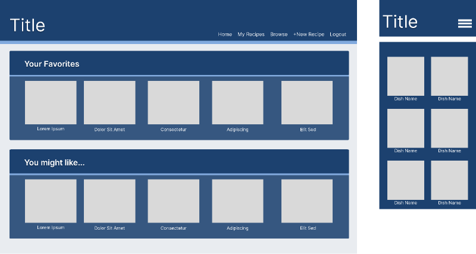

# My Recipe Book

## Description
An application that can be used to store your favorite recipes. Users can add their own recipes to easily store their favorites. Users can sign up and login to save their information so it’s all in one convenient spot. This application was created so that there is a new convenient way to share and store recipies. This will also help with indecisiveness when choosing a meal.

## Installation
To run locally:  
In the .env.example file, fill in DB_USER spot with 'root' and the DB_PASSWORD with your mysql password in quotations
and then delete .example so the file is named .env

In your terminal run the command, npm install

Then in the command line run, `mysql -u root -p` , and input your password

Next, in the msql shell run the command, `source db/schema.sql;`

From there, open a new terminal and input the command `npm run seed`

Then you can start the server by typing `npm start` into your terminal

## Usage
[Demo Video](https://watch.screencastify.com/v/AjubrEXDEIZdRe6j3XG4)  
If the demo video link is not working, you can also find one in this repo in `public/assets/demo`

## Credits
Collaborators:  
[Zel Start](https://github.com/zelstart)  
[Trevor Blanchard](https://github.com/blanchardt)  
[Chris Sullivan](https://github.commy/chris-sully)  

[Unsplash](https://unsplash.com/) || food pictures  

[Vecteezy](https://www.vecteezy.com/) || background image  

[Multer](https://www.npmjs.com/package/multer) || used for file uploads  

[Youtube](https://www.youtube.com/watch?v=EVOFt8Its6I) || used for extra multer comprehension  

## Mockup

## User Story
 AS A... person who cooks food,
 I WANT... to be able to share and store recipies conveniently,
 SO THAT... I am able to find new recipies and keep and store my favorites all in one spot.

## Breakdown of Tasks
Zel- HTML, CSS, Models  
Trevor- Multer and Javascript  
Chris- Controller and Api routes  

## License
MIT License